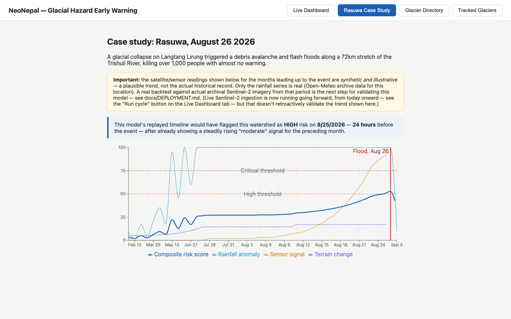
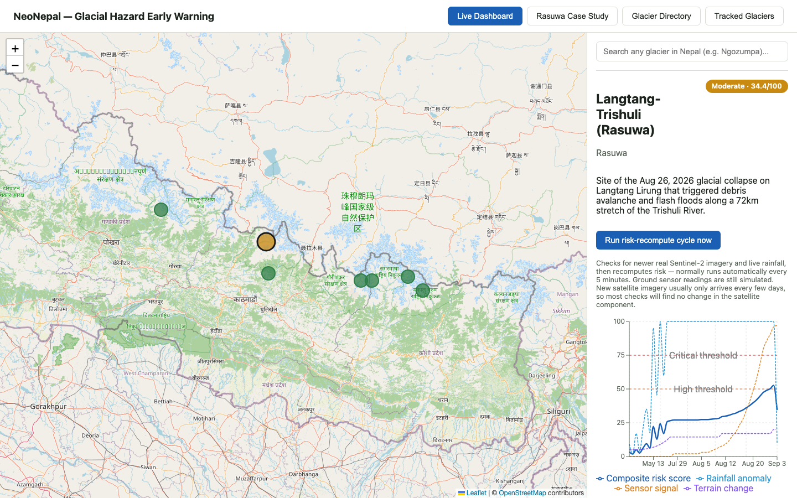
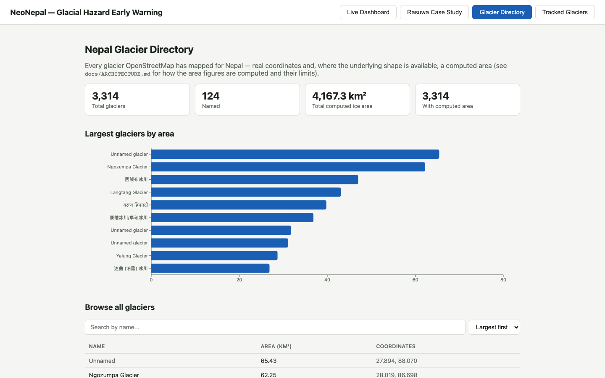
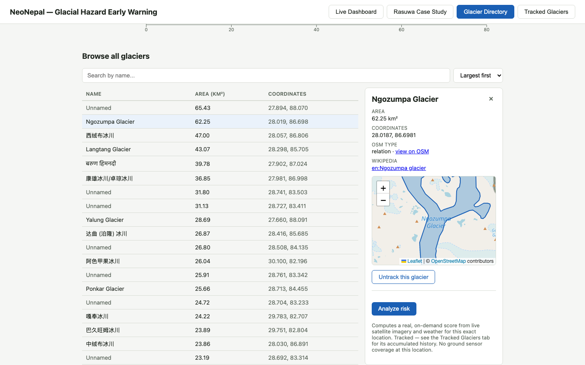
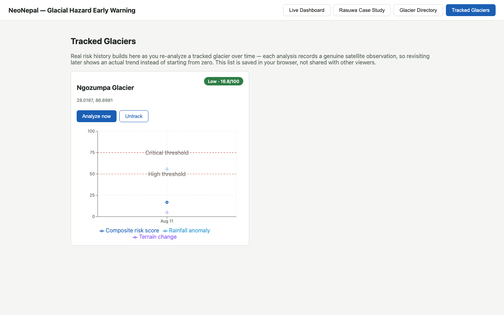

# Screenshots

Captured directly from the running app (`npm run dev` + `uvicorn app.main:app`) via a
headless-browser script, not mocked up — every number visible is real data from the
live pipeline described in [`../ARCHITECTURE.md`](../ARCHITECTURE.md). Ordered as a
before → what-it-does narrative, roughly the order to use in a post.

## 1. The hook — could this have been predicted?

On Aug 26, 2026, a glacial collapse on Langtang Lirung triggered flash floods that
killed over 1,000 people with almost no warning. Replaying the risk model's scoring
logic over the weeks leading up to it — using real historical rainfall data —
shows a rising trend that crosses the "high" alert threshold about **24 hours before
the flood**. The synthetic/real split matters and is disclosed in-app: only the
rainfall series here is real historical data; the satellite/sensor trend is
illustrative pending a real archival-imagery backtest (see the callout box in the
screenshot itself, and [`../DEPLOYMENT.md`](../DEPLOYMENT.md)).

## 2. Live Dashboard

The system doesn't stop at one case study — it actively monitors 7 real,
named, documented high-risk watersheds across Nepal (Rasuwa, Tsho Rolpa, Thulagi,
Lower Barun, Dig Tsho, and more), scored every 5 minutes from live Sentinel-2
satellite imagery (via Microsoft Planetary Computer) and live weather data
(Open-Meteo) — zero API keys required for either.

## 3. Nepal Glacier Directory

Beyond the 7 monitored watersheds: a searchable directory of all 3,314 glaciers
OpenStreetMap has mapped for Nepal, with a real computed area per glacier. The total
— 4,167.3 km² — lines up closely with published ICIMOD estimates (~3,800–4,200 km²),
a nice real-world sanity check on the method.

## 4. Glacier detail — Ngozumpa

Selecting any glacier renders its real outline (from OSM polygon geometry) on a
mini-map, plus computed area, coordinates, and a Wikipedia link where one exists —
here, Ngozumpa, Nepal's longest glacier.

## 5. On-demand analysis, for any of the 3,314

Not just the 7 curated watersheds — click "Analyze risk" on *any* glacier in the
directory for a real, on-demand score from live satellite + weather data, and
"track" it to build a real history over repeated analyses (saved in your browser,
not the server — see [`../ARCHITECTURE.md`](../ARCHITECTURE.md#watch-list--tracked-glaciers)).
